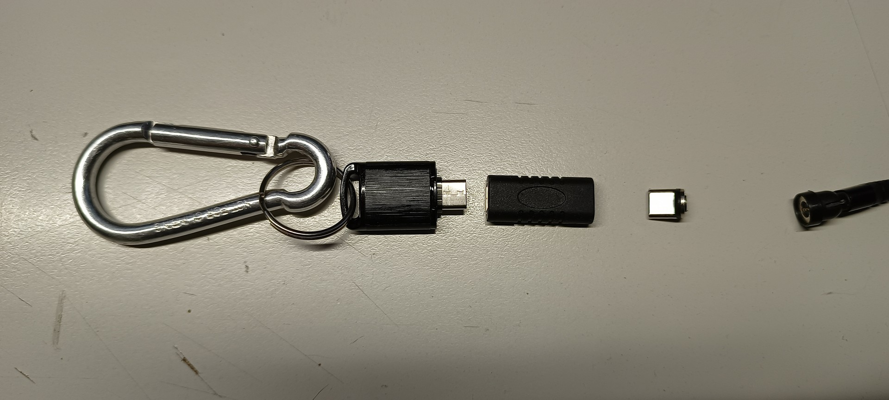
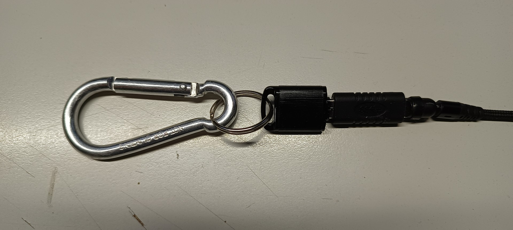
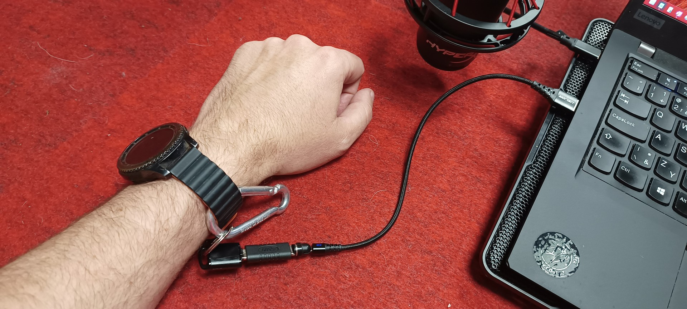

**POOKA is physical security helper that can - like the mythical pooka horses - do both good and evil.**

## Why do you need it?

To be honest, you probably don't. This is fairly specific software for fairly specific usage scenarios related to cybernetic and physical security.

Imagine you are working on your computer, on something powerful adversary, such as government of your country, does not like. If the information is revealed, you'll spend rest of your life in prison. If the skilled adversary gains access to running computer, they can access information stored there, even if you are using full-disk encryption etc. The keys are in memory and can be retrieved from there. 

The only safe state of computer against this adversary is to be turned off. Possibly the correct way, so encryption keys are removed from memory, mere power cutoff may not be good enough.

You won't be able to do that when SWAT team burst trough your doors. Trust me, I know what I'm talking about. But proper hardware and software can help you.

## Software

Pooka is actually quite simple software that runs in background of your Windows computer and periodically checks if certain file on removable storage device still exists. If the device was removed, Pooka will perform the configured action. It can lock your computer, shutdown it or run a custom command.

**Download the latest release from [Releases](https://github.com/ridercz/Pooka/releases/latest) page.** There are two binaries available:

* `pooka.exe` requires .NET 7 runtime to be installed and is smaller.
* `pooka-standalone.exe` is self-contained and does not require .NET runtime, but is larger.

## Hardware

You'll need:

* **USB-C flash drive.** Preferrably small one and in such form factor that you can attach a ring, carabiner or some similar device to it.
* **[USB-C F-F gender changer.](https://s.click.aliexpress.com/e/_DFB4JP1)**
* **[USB-C magnetic cable.](https://s.click.aliexpress.com/e/_DchKLH9)** Choose one with data lines as well, most of them is charging only.

Connect all these things together:

Then attach the flash disk to your person. For example to a belt loop or even better a wristwatch. Configure Pooka to shutdown your computer when the flash drive is disconnected.

Once you move your hand away, for example in the gesture of surrender, your computer will automatically shut down and delete your disk encryption keys from memory.

In the less dramatic scenario, simply attach the flash disk to your belt loop and lock your computer every time you leave your desk automatically, to avoid coworkers pranks.